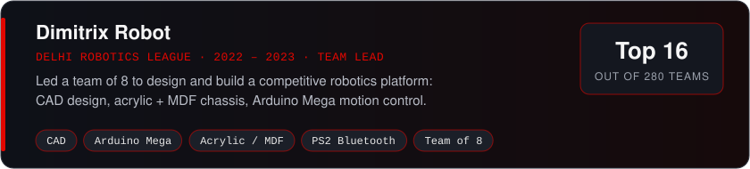
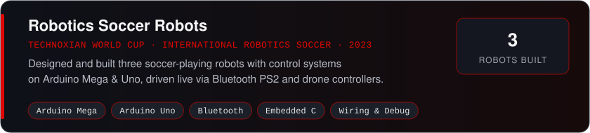
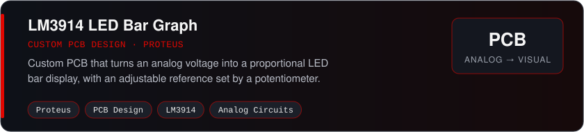

 

## 👋 About Me

I'm **Jayant Gupta (`jayantgpt`)**, an Electronics & Communication Engineering undergraduate student.

I came into electronics through **robotics** — building competition robots, wiring them, debugging them, and driving them on the field. Along the way I found what really pulls me in: **VLSI**. It still astonishes me that we've learned to put billions of transistors on a chip measured in nanometres.

I'm happiest on the **physical side** of engineering:

**Circuit → PCB → Build → Debug → A device that actually works**

## ⚡ Quick Facts

| | |
|---|---|
| 🎓 **Education** | B.Tech ECE, (2025 – 2029) |
| 🔬 **Currently learning** | Semiconductor Devices & Analog Communication |
| 🏎️ **Fascinated by** | Semiconductors · F1 & motorsport electronics · Aerospace |
| 🛠️ **Hands-on with** | Arduino, Raspberry Pi, Proteus PCB design, CAD, 3D printing |
| 🏆 **Best result** | Top 16 of 280 teams — Delhi Robotics League |

## 🧭 Competency Map

| Area | Competencies |
|---|---|
| 🔌 **Embedded Systems** | C/C++, Embedded C, Arduino Mega/Uno, Raspberry Pi, motor & sensor control |
| 🤖 **Robotics** | Robot design, control systems, Bluetooth/PS2 remote control, competition builds |
| 🧩 **PCB & Electronics** | Schematic & PCB design in Proteus, analog circuits, sensor integration, wiring & debugging |
| 🔬 **VLSI & Semiconductors** | Semiconductor device fundamentals |
| 📡 **Communication & IoT** | Analog communication , IoT systems, internships |

## 🛠️ Tech Stack

### Languages & Platforms

## 🚀 Projects

## 🔬 Interests

### Main focus
`VLSI` · `Semiconductor Devices` · `Digital IC Design` · `Embedded Systems` · `Robotics`

### Exploring
`FPGA` · `Analog Circuits` · `Sensors & Instrumentation` · `Signal Processing` · `Communication Systems`

### Where electronics excites me most
`Semiconductor industry` · `F1 / Motorsport electronics` · `Aerospace & space electronics`

